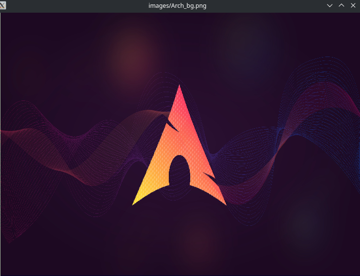

# Neutron Image Viewer



## Features

 - multiple files
 - vim keybindings
 - detect displayable files in directory (by file extension)
 - recursive file search in directory

## Anti Features

 - somewhat bad performance
 - bad scales

## Installation

```
sudo make install
```

## Usage

```
niv [files/dirs]
```

### Navigation

go to next picture by pressing the ```right arrow key```, ```n```, ```l```, ```j```, ```s```

go to previous picture by pressing ```the left arrow key```, ```p```, ```h```, ```k```, ```w```, ```a```

Print debug info with ```d```

